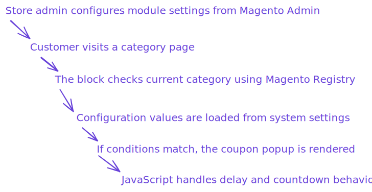
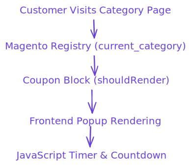

# Customer Coupon Show Module (Magento 2)


A lightweight Magento 2 module that displays targeted discount coupons to customers based on the category they are currently browsing.

This module allows store administrators to configure a category-specific promotional popup with customizable discount values, display delay, and expiration time.  
It demonstrates clean Magento architecture patterns such as blocks, system configuration, dependency injection, registry usage, and frontend component integration.

The goal of this module is not only to provide a marketing tool for category-based promotions, but also to showcase structured Magento module development and frontend interaction patterns.


---

## Table of Contents

- [Overview](#overview)
- [Features](#features)
- [How It Works](#how-it-works)
  - [Architecture Flow](#architecture-flow)
- [Conceptual Proccess of Creation](#conceptual-proccess-of-creation)
- [Magento Concepts](#magento-concepts)
- [Admin Configuration](#admin-configuration)
  - [Available Settings](#available-settings)
  - [Configuration Behavior](#configuration-behavior)
- [Installation](#installation)
  - [Requirements](#requirements)
  - [Installation Steps](#installation-steps)
- [Usage](#usage)
  - [Enable Coupon Popup](#enable-coupon-popup)
- [Module Structure](#module-structure)
- [Design Decisions](#design-decisions)
  - [Category Targeting](#category-targeting)
  - [Lightweight Frontend Execution](#lightweight-frontend-execution)
- [Uninstall](#uninstall)
- [Author](#author)


---

## Overview

`Mauro_CustomerCouponShow` displays a promotional coupon popup when a customer visits a specific category page.

The module checks:

- If the module is enabled
- If the current category matches the configured category
- Configurable display delay
- Discount percentage
- Coupon expiration timer

When conditions are satisfied, a styled promotional popup is shown to the user.

The configuration is fully manageable from the Magento admin panel.

---

## Features

- Admin configurable popup behavior
- Custom discount percentage configuration
- Configurable popup delay
- Coupon expiration timer
- Conditional rendering based on category
- Magento admin system configuration panel
- Dynamic category selector with hierarchy path
- Lightweight frontend implementation
- Animated and responsive popup UI

---

## How It Works

The module follows a simple configuration-driven flow:



### Architecture Flow



## Conceptual proccess of creation


---

## Magento Concepts

This module showcases several core Magento concepts:

- Magento Blocks (`Template` block usage)
- System configuration (`system.xml`)
- Default configuration (`config.xml`)
- Magento Registry (`current_category`)
- Custom source models for admin fields
- Dynamic category selector
- Frontend JS component initialization
- Magento module registration
- Scoped configuration values (store level)

---

## Admin Configuration

The module provides a configuration section in Magento Admin:

```
Stores → Configuration → discount_coupons → General
```

### Available Settings

- Enable Module
- Delay to show popup (seconds)
- Discount Percentage
- Coupon Life Time (seconds)
- Category where coupon should appear


### Configuration Behavior

- Coupon only appears when module is enabled
- Popup only renders for selected category
- Delay controls when popup opens
- Discount value is displayed dynamically
- Expiration controls countdown timer

Default values:

| Setting    | Default    |
| ---------- | ---------- |
| Enabled    | Yes        |
| Delay      | 5 seconds  |
| Discount   | 50%        |
| Expiration | 10 seconds |

---

## Installation

### Requirements


Magento 2.4+

- Composer (2.9.3 o superior)
- OpenSearch (3)
- MariaDB (11.4)
- New Relic (No requerido)
- PHP (8.4 o 8.3)
- RabbitMQ (4.1)
- ActiveMQ Artemis (2)
- Valkey (8)
- nginx (1.28)

You can see more specifications here

https://experienceleague.adobe.com/en/docs/commerce-operations/installation-guide/system-requirements

Recommended development environment (I used this to develop the module):

https://github.com/markshust/docker-magento

---

### Installation Steps

Navigate to your Magento project root and install the module:

```
mkdir -p app/code/Mauro/CustomerCouponShow
git clone https://github.com/maruccimauro/magento-2-customer-coupon-show-Module.git src/app/code/Mauro/CustomerCouponShow
```

Enable the module:

```
php bin/magento module:enable Mauro_CustomerCouponShow
php bin/magento setup:upgrade
php bin/magento setup:static-content:deploy -f
php bin/magento cache:flush
```

---

## Usage

### Enable Coupon Popup

1. Go to Magento Admin configuration
2. Enable the module
3. Select a category
4. Configure discount and timing
5. Save configuration

The coupon popup will appear automatically when customers visit the configured category.

---

## Module Structure

```
Mauro/CustomerCouponShow
├── Block/
│   └── Coupon.php
├── Model/
│   └── Config/Source/
│       └── Category.php
├── etc/
│   ├── module.xml
│   ├── config.xml
│   └── adminhtml/
│       └── system.xml
├── view/frontend/
│   └── web/
│       ├── css/
│       │   └── coupon.css
│       └── js/
│           └── coupon.js
└── registration.php
```

---

## Design Decisions

### Category Targeting

Using Magento Registry allows detecting the current category without modifying controllers.

Benefits:

- Minimal system impact
- Clean integration
- Easy extension
- No core overrides

### Lightweight Frontend Execution

Frontend logic is handled using simple JavaScript timers and conditional rendering.

This ensures:

- Low performance impact
- Fast execution
- Smooth user experience

---

## Uninstall

To remove the module:

```
php bin/magento module:disable Mauro_CustomerCouponShow
rm -rf app/code/Mauro/CustomerCouponShow
php bin/magento setup:upgrade
```

---

## Author

Mauro Marucci
