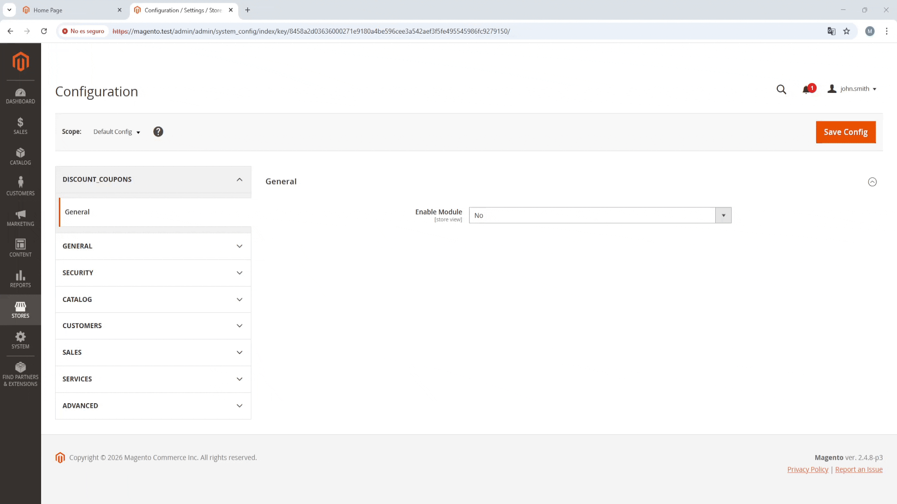
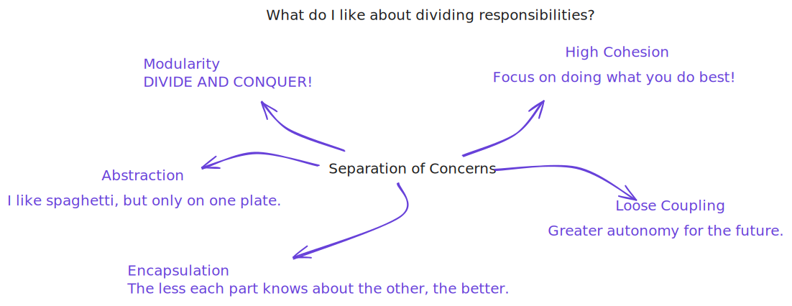
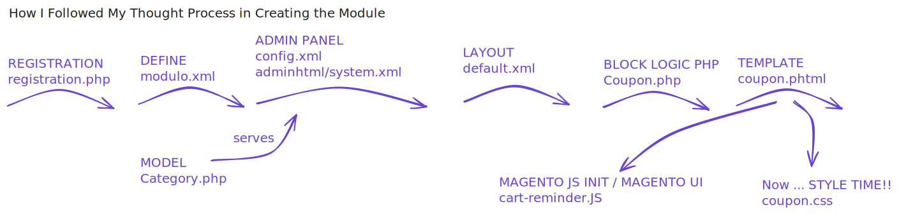

# CustomerCouponShow Module

A Magento 2 module that shows a configurable coupon popup based on the current product category, allowing admins to control its behavior from the Magento panel while demonstrating Magento’s modular architecture and configuration system.




---

## Description

CustomerCouponShow is a Magento 2 module that provides a category-aware promotional popup displayed to users when browsing specific catalog categories. The behavior of the popup is fully configurable through the Magento admin configuration panel, allowing control over activation, display timing, discount value, expiration period, and target category.

The module integrates Magento system configuration, dynamic category sourcing, layout rendering, and frontend JavaScript behavior. Its implementation follows a modular structure with clear separation between configuration, data sourcing, presentation, and client-side interaction.

The purpose of this project is to demonstrate practical Magento development patterns, including system configuration handling, source models, layout injection, and frontend component initialization.



---

## Magento Concepts Covered

- Magento module registration and configuration structure
- System configuration fields (`system.xml`, `config.xml`)
- Source models for dynamic admin configuration options
- Category collection handling
- Block and template rendering
- Layout XML integration
- Frontend asset management (CSS and JavaScript)
- RequireJS component initialization
- Conditional rendering based on runtime context
- Separation of configuration, business logic, and presentation



---

## Installation

### Prerequisites

This module was developed on Magento 2.4.8.  
It is recommended to use a local Magento environment https://github.com/markshust/docker-magento, such as markshust/docker-magento, for development and testing.

### Installation Steps

Navigate to your Magento project root directory.
Create the module directory and clone the repository:

```bash
    mkdir -p app/code/Mauro/CustomerCouponShow
    git clone https://github.com/maruccimauro/magento-2-customer-coupon-show-Module.git src/app/code/Mauro/CustomerCouponShow
```

### Enable the module

```bash
    bin/magento module:enable Mauro_CartReminder
    php bin/magento setup:upgrade
    php bin/magento setup:static-content:deploy -f
    php bin/magento cache:flush
```

---

## Module Structure

```
Mauro/CustomerCouponShow
├── Block
│   └── Coupon.php
├── etc
│   ├── module.xml
│   ├── config.xml
│   └── adminhtml
│       └── system.xml
├── Model
│   └── Config
│       └── Source
│           └── Category.php
├── view
│   └── frontend
│       ├── layout
│       │   └── default.xml
│       ├── templates
│       │   └── coupon.phtml
│       └── web
│           ├── css
│           │   └── coupon.css
│           └── js
│               └── coupon.js
└── registration.php
```

---

## Author

Author: Mauro Marucci
